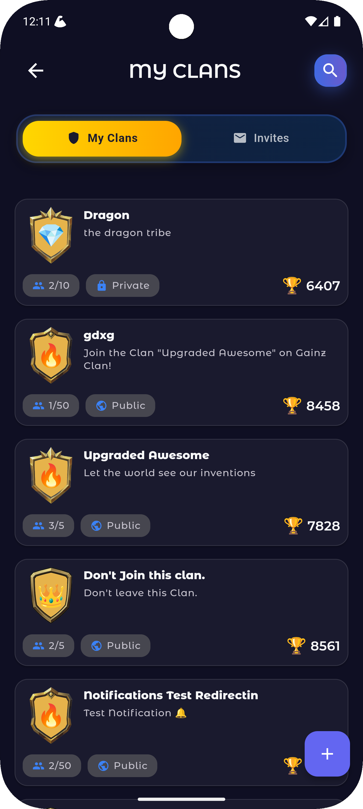

# <p align="center"><br>Gainz App (GainzClan)</p>

<p align="center">
  
  
  
  
</p>

<p align="center"><b>A competitive fitness RPG that turns workouts into clan battles.</b></p>

<p align="center">
  <a href="https://play.google.com/store/apps/details?id=com.ssgit.gainzclan">
    
  </a>
  &nbsp;&nbsp;
  <a href="https://apps.apple.com/us/app/gainz-app/id6751576980">
    
  </a>
</p>

## 📱 App Preview

<div align="center">
  <table>
    <tr>
      <td align="center">
        
        <br><em>Welcome</em>
      </td>
      <td align="center">
        
        <br><em>Home</em>
      </td>
      <td align="center">
        
        <br><em>Battles</em>
      </td>
      <td align="center">
        
        <br><em>My Clans</em>
      </td>
    </tr>
    <tr>
      <td align="center">
        
        <br><em>Clan Info</em>
      </td>
      <td align="center">
        
        <br><em>Leaderboard</em>
      </td>
      <td align="center">
        
        <br><em>Chat</em>
      </td>
      <td align="center">
        
        <br><em>Profile</em>
      </td>
    </tr>
  </table>
</div>

---

## Table of Contents

- [Overview](#overview)
- [Features](#features)
- [Business Scenarios (Use Cases)](#business-scenarios-use-cases)
- [Architecture](#architecture)
- [Tech Stack & Dependencies](#tech-stack--dependencies)
- [Getting Started](#getting-started)
- [Running the App](#running-the-app)
- [Building for Release](#building-for-release)
- [Configuration](#configuration)
- [Data & Privacy](#data--privacy)
- [Testing](#testing)
- [CI/CD (Recommended)](#cicd-recommended)
- [Screenshots](#screenshots)
- [Roadmap](#roadmap)
- [Contributing](#contributing)
- [Troubleshooting](#troubleshooting)
- [License](#license)
- [Acknowledgments & Contact](#acknowledgments--contact)

---

## Overview

Gainz App transforms fitness into an engaging multiplayer RPG experience where users join clans, compete in real-time battles, and level up through actual workouts. By gamifying exercise with ranks, badges, XP systems, and clan wars, we solve the motivation crisis in fitness by making every workout count toward your clan's dominance. Built with Flutter for seamless cross-platform performance, the app integrates AI-powered workout generation, real-time heart rate monitoring via Wear OS and Health Connect, and a complete wallet system for rewards and challenges.

## Features

- **⚔️ Real-Time Clan Battles**: Compete head-to-head with other clans in live workout challenges with WebSocket-powered leaderboards
- **🏅 Ranks & Badges System**: Progress through Bronze → Silver → Gold → Diamond → Legendary ranks with visual achievement tracking
- **📊 Live Leaderboards**: Real-time competition tracking with anti-cheat measures and fair scoring algorithms
- **🤖 AI Workout Generation**: Personalized workout plans generated through prompted AI with exercise estimations and contraindication awareness
- **❤️ Heart Rate Integration**: Seamless 5-second sync from Wear OS devices to phone to Health Connect (Android) with iOS HealthKit awareness
- **💰 Wallet & Rewards System**: Stripe/Mamo-powered top-ups, secure escrow for challenges, and instant payouts for winners
- **📱 Push Notifications**: Firebase-powered reminders, battle alerts, and clan invitations with smart consent management
- **🔒 Privacy-First Design**: Granular consent controls, minimal data retention, and transparent health data handling
- **🎮 Gamification Elements**: XP bars, progress quests, streak counters, and motivational nudges
- **💬 Clan Chat & Social**: Real-time messaging, clan management, and deep-link invitations

## Business Scenarios (Use Cases)

### 1. Quick Clash
**Actors**: Individual user, opponent  
**Trigger**: User taps "Quick Battle" from home screen  
**Preconditions**: User logged in, permissions granted  
**Happy Path**: User joins 3-minute pushup challenge → phone sensors track reps → real-time score updates → winner gets XP  
**Edge Cases**: Network dropout (local caching), sensor failure (manual input fallback)  
**Analytics**: battle_started, battle_completed, sensor_accuracy

### 2. Clan War Marathon
**Actors**: Clan leaders, clan members, rival clans  
**Trigger**: Scheduled weekly clan challenge notification  
**Preconditions**: Minimum 5 members per clan, wallet funds for entry  
**Happy Path**: 48-hour scoring window → members complete workouts → aggregate scores → winning clan splits prize pool  
**Edge Cases**: Member leaves mid-challenge (score retained), suspicious activity (anti-cheat review)  
**Analytics**: clan_war_joined, member_contribution, prize_distributed

### 3. Personal Trainer with Medical Awareness
**Actors**: User with health conditions, AI trainer  
**Trigger**: User starts "Custom Workout" with profile flags  
**Preconditions**: Health profile completed, contraindications noted  
**Happy Path**: AI generates modified workout → excludes flagged exercises → provides alternatives → tracks safe completion  
**Edge Cases**: Emergency stop button, heart rate spike detection, rest day enforcement  
**Analytics**: workout_modified, safety_trigger, completion_rate

### 4. Wallet & Rewards Flow
**Actors**: User, payment processor, clan treasury  
**Trigger**: User enters paid challenge or tops up wallet  
**Preconditions**: KYC if required, valid payment method  
**Happy Path**: Top-up via Stripe → funds in escrow → challenge completion → automatic payout or refund  
**Edge Cases**: Payment failure (retry logic), dispute resolution, partial refunds for incomplete challenges  
**Analytics**: payment_initiated, escrow_held, payout_processed

### 5. Onboarding & Retention Journey
**Actors**: New user, retention system  
**Trigger**: App first launch  
**Preconditions**: App installed from store  
**Happy Path**: Day 1 (tutorial battle) → Day 7 (join clan prompt) → Day 30 (rank achievement) → ongoing streaks  
**Edge Cases**: Skip onboarding (quick start), re-engagement after dormancy  
**Analytics**: onboarding_step, retention_day_7, streak_maintained

### 6. Heart Rate Training Zone
**Actors**: User with wearable, Wear OS device  
**Trigger**: User starts cardio workout  
**Preconditions**: Wear OS paired, Health Connect permissions  
**Happy Path**: Real-time HR sync every 5s → zone indicators → automatic intensity adjustment → post-workout analysis  
**Edge Cases**: Device disconnection (last known value), battery warning  
**Analytics**: hr_sync_rate, zone_time, device_type

### 7. Social Clan Recruitment
**Actors**: Clan leader, prospective members  
**Trigger**: Leader shares clan invite link  
**Preconditions**: Clan has open slots  
**Happy Path**: Deep link shared → app opens to clan preview → one-tap join → welcome message  
**Edge Cases**: Clan full (waitlist), link expired (regenerate)  
**Analytics**: invite_sent, deep_link_conversion, clan_growth

### 8. Anti-Cheat Investigation
**Actors**: System monitor, flagged user, review team  
**Trigger**: Abnormal performance metrics detected  
**Preconditions**: Baseline performance established  
**Happy Path**: Automatic flag → video proof request → manual review → decision (cleared/banned)  
**Edge Cases**: False positive (appeal process), repeat offender escalation  
**Analytics**: cheat_detected, review_outcome, ban_rate

### 9. Seasonal Tournament
**Actors**: All active users, tournament system  
**Trigger**: Quarterly tournament announcement  
**Preconditions**: Rank requirements met  
**Happy Path**: Registration → bracket generation → daily matches → elimination rounds → grand prize  
**Edge Cases**: Bye rounds, timezone fairness, dropout management  
**Analytics**: tournament_signups, match_completion, prize_pool

### 10. Injury Recovery Mode
**Actors**: Injured user, adaptive system  
**Trigger**: User reports injury in settings  
**Preconditions**: Injury type selected  
**Happy Path**: Workouts adapt to injury → alternative exercises → gradual return protocol → full recovery celebration  
**Edge Cases**: Re-injury detection, medical clearance requirement  
**Analytics**: injury_reported, adaptation_used, recovery_time

## Architecture

```
┌─────────────────────────────────────────────────────────────┐
│                     Presentation Layer                       │
│  ┌──────────┐  ┌──────────┐  ┌──────────┐  ┌──────────┐   │
│  │  Views   │  │  Widgets │  │Controllers│  │  Bindings│   │
│  │  (UI)    │  │(Reusable)│  │  (GetX)   │  │   (DI)   │   │
│  └──────────┘  └──────────┘  └──────────┘  └──────────┘   │
└─────────────────────────────────────────────────────────────┘
                              │
                              ▼
┌─────────────────────────────────────────────────────────────┐
│                       Domain Layer                          │
│  ┌──────────┐  ┌──────────┐  ┌──────────┐  ┌──────────┐   │
│  │Use Cases │  │ Entities │  │  Models  │  │Interfaces│   │
│  │          │  │          │  │          │  │  (Repos) │   │
│  └──────────┘  └──────────┘  └──────────┘  └──────────┘   │
└─────────────────────────────────────────────────────────────┘
                              │
                              ▼
┌─────────────────────────────────────────────────────────────┐
│                        Data Layer                           │
│  ┌──────────┐  ┌──────────┐  ┌──────────┐  ┌──────────┐   │
│  │   Dio    │  │WebSockets│  │  Local   │  │ External │   │
│  │   API    │  │   (Live) │  │  Storage │  │ Services │   │
│  └──────────┘  └──────────┘  └──────────┘  └──────────┘   │
│         │             │             │             │         │
│         └─────────────┴─────────────┴─────────────┘        │
│                           │                                 │
│                    Repository Impl                          │
└─────────────────────────────────────────────────────────────┘
```

### Folder Structure
```
lib/
├── app/
│   ├── config/          # App configuration, themes, constants
│   ├── routes/          # GoRouter navigation setup
│   └── bindings/        # GetX dependency injection
├── data/
│   ├── models/          # Data models and DTOs
│   ├── repositories/    # Repository implementations
│   ├── datasources/     # Remote and local data sources
│   └── services/        # External services (Firebase, Health)
├── domain/
│   ├── entities/        # Business entities
│   ├── repositories/    # Repository interfaces
│   └── usecases/        # Business logic
├── presentation/
│   ├── controllers/     # GetX controllers
│   ├── views/          # Screen widgets
│   ├── widgets/        # Reusable UI components
│   └── utils/          # UI utilities
└── main.dart           # Entry point
```

### Technical Considerations

- **State Management**: GetX for reactive state management with .obs patterns and GetBuilder for complex states
- **Dependency Injection**: GetX bindings with lazy loading for memory optimization
- **Error Handling**: Global error boundaries with Dio interceptors and try-catch wrapping
- **Logging**: Structured logging with log levels (verbose/debug/info/warning/error)
- **Threading**: Isolates for ML pose detection and heavy computations to maintain 60fps
- **Image Caching**: Memory and disk caching for clan avatars and achievement badges
- **iOS Privacy**: Required Reason APIs declared for UserDefaults, file timestamps, system boot time
- **Android Permissions**: Health Connect scopes for heart rate, steps, calories with granular consent

## Tech Stack & Dependencies

### Core Requirements
- **Flutter SDK**: 3.8.1+ (Channel stable)
- **Dart SDK**: Compatible with Flutter 3.8.1
- **Android**: 
  - Min SDK: 21 (Android 5.0)
  - Target SDK: 34 (Android 14)
  - Gradle: 8.0+ with Kotlin DSL
  - Java: 17 LTS
- **iOS**:
  - Minimum iOS: 13.0
  - Xcode: 15.0+
  - CocoaPods: 1.15.0+

### Key Dependencies
- **State Management**: GetX 4.7.2 (reactive programming, routing, DI)
- **Navigation**: GoRouter (declarative routing with deep links)
- **Networking**: Dio 5.8.0 (REST API), socket_io_client 2.0.3 (WebSockets)
- **Firebase**: Core 4.0.0, Messaging 16.0.0 (push notifications, analytics)
- **ML/AI**: google_mlkit_pose_detection 0.13.0 (exercise tracking)
- **Media**: camera 0.10.5, audioplayers 6.4.0 (workout feedback)
- **UI/UX**: flutter_screenutil 5.9.3, shimmer 3.0.0, lottie 3.3.1
- **Charts**: fl_chart 0.69.0 (progress visualization)
- **Storage**: shared_preferences 2.5.3 (local settings)
- **Utilities**: intl 0.19.0 (i18n), timezone 0.10.0, permission_handler 11.3.1

See [pubspec.yaml](pubspec.yaml) for complete dependency list.

## Getting Started

### Prerequisites

1. **Flutter SDK Installation**
   ```bash
   # Download Flutter SDK from https://flutter.dev
   # Add to PATH
   export PATH="$PATH:[PATH_TO_FLUTTER]/flutter/bin"
   ```

2. **Platform Setup**
   - **Android**: Install Android Studio with SDK 34+, Java 17
   - **iOS**: Install Xcode 15+, CocoaPods (`sudo gem install cocoapods`)

3. **Verify Installation**
   ```bash
   flutter doctor -v
   # Ensure all checks pass for Android and iOS
   ```

### Project Setup

1. **Clone and Install Dependencies**
   ```bash
   git clone [repository_url]
   cd gainz_clan
   flutter pub get
   ```

2. **Platform Configuration**
   ```bash
   # iOS pods installation
   cd ios && pod install && cd ..
   
   # Ensure only Android and iOS are enabled
   flutter config --enable-android --enable-ios
   flutter config --no-enable-web --no-enable-macos --no-enable-linux --no-enable-windows
   ```

3. **Firebase Setup** (via FlutterFire CLI)
   ```bash
   # Install FlutterFire CLI
   dart pub global activate flutterfire_cli
   
   # Configure Firebase project
   flutterfire configure \
     --project=[your-project-id] \
     --platforms=android,ios \
     --android-package-name=com.yourcompany.gainz_clan \
     --ios-bundle-id=com.yourcompany.gainzClan
   ```

4. **Android Signing Configuration**
   
   Create `android/key.properties` (DO NOT COMMIT):
   ```properties
   storePassword=your_keystore_password
   keyPassword=your_key_password
   keyAlias=upload
   storeFile=../keys/upload-keystore.jks
   ```
   
   Generate upload keystore:
   ```bash
   keytool -genkey -v -keystore keys/upload-keystore.jks \
     -keyalg RSA -keysize 2048 -validity 10000 \
     -alias upload
   ```

5. **iOS Signing**
   - Open `ios/Runner.xcworkspace` in Xcode
   - Select Runner target → Signing & Capabilities
   - Select your team and update bundle identifier
   - Enable required capabilities (Push Notifications, HealthKit)

## Running the App

### Development Mode

```bash
# Android
flutter run -d android

# iOS (requires Mac with Xcode)
flutter run -d ios

# List available devices
flutter devices

# Run with verbose output for debugging
flutter run -v
```

### Debug vs Release Builds

```bash
# Debug build (with assertions and debug info)
flutter run --debug

# Profile build (performance testing)
flutter run --profile

# Release build (optimized for production)
flutter run --release

# Hot reload (during development)
# Press 'r' in terminal while app is running

# Hot restart (reset app state)
# Press 'R' in terminal
```

## Building for Release

### Android (.aab for Google Play)

1. **Configure signing** (ensure `key.properties` and keystore are set up)

2. **Build App Bundle**
   ```bash
   flutter build appbundle --release
   # Output: build/app/outputs/bundle/release/app-release.aab
   ```

3. **Verify signature** (ensure not debug-signed)
   ```bash
   # Check certificate CN is not "Android Debug"
   jarsigner -verify -verbose -certs \
     build/app/outputs/bundle/release/app-release.aab
   ```

4. **Play Console Upload**
   - Use Play App Signing for key management
   - Upload .aab to Internal/Beta/Production track
   - Play Console handles APK generation and distribution

### iOS (TestFlight/App Store)

1. **Update version and build number**
   ```bash
   # In pubspec.yaml: version: 1.0.1+5
   # Or via Xcode: Runner → General → Version/Build
   ```

2. **Privacy Configuration**
   
   Add to `ios/Runner/Info.plist`:
   ```xml
   <key>NSHealthShareUsageDescription</key>
   <string>Track workouts and sync with clan battles</string>
   <key>NSCameraUsageDescription</key>
   <string>Capture exercise form for AI coaching</string>
   <key>NSUserTrackingUsageDescription</key>
   <string>Optimize your fitness journey with personalized insights</string>
   ```

3. **Build and Archive**
   ```bash
   flutter build ios --release
   
   # Then in Xcode:
   # 1. Open ios/Runner.xcworkspace
   # 2. Product → Archive
   # 3. Validate (check for common issues)
   # 4. Distribute → App Store Connect
   ```

4. **Export Compliance**
   - Add to `Info.plist` if no encryption:
   ```xml
   <key>ITSAppUsesNonExemptEncryption</key>
   <false/>
   ```

5. **Common TestFlight Issues**
   - **Invalid Binary**: Check provisioning profiles, capabilities match
   - **Required Reason APIs**: Ensure privacy manifests for UserDefaults usage
   - **Firebase Privacy**: Update to latest Firebase SDK with privacy manifests
   - **Processing Failed**: Disable bitcode, check min iOS version (13.0)

## Configuration

### Environment Variables

Create `.env` files for each environment (not committed):

```bash
# .env.development
API_BASE_URL=https://dev-api.gainzapp.com
WEBSOCKET_URL=wss://dev-ws.gainzapp.com
STRIPE_PUBLISHABLE_KEY=pk_test_...
AI_API_KEY=sk-...

# .env.production
API_BASE_URL=https://api.gainzapp.com
WEBSOCKET_URL=wss://ws.gainzapp.com
STRIPE_PUBLISHABLE_KEY=pk_live_...
AI_API_KEY=sk-...
```

### Firebase Configuration
- `android/app/google-services.json` (from Firebase Console)
- `ios/Runner/GoogleService-Info.plist` (from Firebase Console)
- Both files in `.gitignore` - use CI secrets for builds

### Feature Toggles

```dart
class FeatureFlags {
  static const bool aiWorkoutsEnabled = true;
  static const bool payoutsEnabled = true;
  static const bool wearOSEnabled = true;
  static const bool antiCheatEnabled = true;
}
```

### Remote Config
Use Firebase Remote Config for runtime feature flags:
- `min_app_version`: Force update mechanism
- `maintenance_mode`: Temporary service disruption
- `clan_size_limit`: Dynamic clan member limits
- `battle_entry_fee`: Adjustable challenge costs

### Secrets Management
**NEVER commit**:
- Keystores (`*.jks`, `*.keystore`)
- Key properties files
- API keys in code
- Firebase config files (use CI variables)
- `.env` files

Use GitHub Secrets or equivalent CI/CD secret management.

## Data & Privacy

### Health Data Handling
- **Consent First**: Explicit opt-in for health data with granular permissions
- **Minimal Collection**: Only collect required fitness metrics (HR, steps, calories)
- **Local Processing**: ML pose detection runs on-device
- **Retention**: Health data deleted after 30 days of inactivity
- **Export/Delete**: Users can export or delete all data via settings

### iOS Privacy Requirements
**Required Reason APIs** (declare in privacy manifest):
- `NSPrivacyAccessedAPICategoryUserDefaults`: Store user preferences
- `NSPrivacyAccessedAPICategoryFileTimestamp`: Cache management
- `NSPrivacyAccessedAPICategorySystemBootTime`: Session tracking

### Android Health Connect
**Requested Scopes**:
- `android.permission.health.READ_HEART_RATE`
- `android.permission.health.READ_STEPS`
- `android.permission.health.READ_ACTIVE_CALORIES_BURNED`
- `android.permission.health.WRITE_EXERCISE`

### Analytics & Crash Reporting
- **Firebase Analytics**: Aggregated, non-PII event tracking
- **Crash Logs**: Stack traces only, no user data
- **Opt-out Available**: Settings → Privacy → Analytics toggle

### Compliance Links
- Privacy Policy: [https://gainzapp.com/privacy](https://gainzapp.com/privacy)
- Terms of Service: [https://gainzapp.com/terms](https://gainzapp.com/terms)
- Data Processing Agreement: Available on request

## Testing

### Test Structure
```bash
test/
├── unit/           # Business logic tests
├── widget/         # UI component tests  
├── integration/    # End-to-end flows
└── golden/         # Visual regression tests
```

### Running Tests

```bash
# Run all tests
flutter test

# Run with coverage
flutter test --coverage
genhtml coverage/lcov.info -o coverage/html
open coverage/html/index.html

# Run specific test file
flutter test test/unit/clan_controller_test.dart

# Run tests continuously (watch mode)
flutter test --reporter expanded --watch
```

### Testing Strategy

**Unit Tests** (Target: 80% coverage)
```dart
// Mock repositories and services
final mockClanRepo = MockClanRepository();
when(mockClanRepo.fetchClans()).thenAnswer(
  (_) async => [TestData.sampleClan()]
);
```

**Widget Tests**
```dart
// Test UI interactions
await tester.pumpWidget(MaterialApp(home: BattleView()));
await tester.tap(find.text('Start Battle'));
await tester.pumpAndSettle();
expect(find.byType(CircularProgressIndicator), findsOneWidget);
```

**Golden Tests** (Critical UI elements)
```dart
// Visual regression for badges, progress bars
await tester.pumpWidget(RankBadge(rank: Rank.gold));
await expectLater(
  find.byType(RankBadge),
  matchesGoldenFile('goldens/rank_badge_gold.png')
);
```

**Integration Tests**
```bash
# Run on real device/emulator
flutter drive --target=test_driver/app.dart
```

### CI Testing Requirements
- All tests must pass before merge
- Coverage must not decrease below 70%
- Golden tests regenerated on design changes
- Performance tests for 60fps maintenance

## CI/CD (Recommended)

### GitHub Actions Pipeline

Create `.github/workflows/main.yml`:

```yaml
name: CI/CD Pipeline

on:
  push:
    branches: [main, develop]
  pull_request:
    branches: [main]

jobs:
  test:
    runs-on: ubuntu-latest
    steps:
      - uses: actions/checkout@v3
      
      - uses: subosito/flutter-action@v2
        with:
          flutter-version: '3.8.1'
          channel: 'stable'
          cache: true
      
      - name: Install dependencies
        run: flutter pub get
      
      - name: Analyze code
        run: flutter analyze
      
      - name: Run tests
        run: flutter test --coverage
      
      - name: Check formatting
        run: dart format --set-exit-if-changed .

  build-android:
    needs: test
    runs-on: ubuntu-latest
    steps:
      - uses: actions/checkout@v3
      
      - uses: subosito/flutter-action@v2
        with:
          flutter-version: '3.8.1'
          cache: true
      
      - name: Setup keystore
        env:
          KEYSTORE_BASE64: ${{ secrets.KEYSTORE_BASE64 }}
          KEY_PROPERTIES: ${{ secrets.KEY_PROPERTIES }}
        run: |
          echo "$KEYSTORE_BASE64" | base64 -d > android/upload-keystore.jks
          echo "$KEY_PROPERTIES" > android/key.properties
      
      - name: Build AAB
        run: flutter build appbundle --release
      
      - name: Upload AAB artifact
        uses: actions/upload-artifact@v3
        with:
          name: app-release.aab
          path: build/app/outputs/bundle/release/app-release.aab

  build-ios:
    needs: test
    runs-on: macos-latest
    steps:
      - uses: actions/checkout@v3
      
      - uses: subosito/flutter-action@v2
        with:
          flutter-version: '3.8.1'
          cache: true
      
      - name: Install pods
        run: cd ios && pod install
      
      - name: Build IPA
        run: flutter build ios --release --no-codesign
      
      - name: Archive IPA
        run: |
          xcodebuild -workspace ios/Runner.xcworkspace \
            -scheme Runner \
            -configuration Release \
            -archivePath build/Runner.xcarchive \
            archive
```

### Fastlane Integration (Optional)

**Android** (`android/fastlane/Fastfile`):
```ruby
lane :deploy do
  gradle(task: 'bundle', build_type: 'Release')
  upload_to_play_store(
    track: 'internal',
    aab: '../build/app/outputs/bundle/release/app-release.aab'
  )
end
```

**iOS** (`ios/fastlane/Fastfile`):
```ruby
lane :beta do
  build_app(workspace: "Runner.xcworkspace", scheme: "Runner")
  upload_to_testflight(
    skip_waiting_for_build_processing: true
  )
end
```

### Cache Optimization
- Cache Flutter SDK between runs
- Cache pub packages with `actions/cache`
- Cache CocoaPods with `~/.cocoapods` path
- Cache Gradle with `~/.gradle/caches`

## Screenshots

<div align="center">
  <table>
    <tr>
      <td align="center">
        
        <br><em>Splash</em>
      </td>
      <td align="center">
        
        <br><em>Login</em>
      </td>
      <td align="center">
        
        <br><em>Register</em>
      </td>
      <td align="center">
        
        <br><em>Home</em>
      </td>
    </tr>
    <tr>
      <td align="center">
        
        <br><em>Battles</em>
      </td>
      <td align="center">
        
        <br><em>Clan Challenge</em>
      </td>
      <td align="center">
        
        <br><em>My Clans</em>
      </td>
      <td align="center">
        
        <br><em>Clan Info</em>
      </td>
    </tr>
    <tr>
      <td align="center">
        
        <br><em>Members</em>
      </td>
      <td align="center">
        
        <br><em>Chat</em>
      </td>
      <td align="center">
        
        <br><em>Create Clan</em>
      </td>
      <td align="center">
        
        <br><em>Search</em>
      </td>
    </tr>
    <tr>
      <td align="center">
        
        <br><em>Profile</em>
      </td>
      <td align="center">
        
        <br><em>Settings</em>
      </td>
      <td align="center">
        
        <br><em>Permissions</em>
      </td>
      <td align="center">
        
        <br><em>Matchmaking</em>
      </td>
    </tr>
  </table>
</div>

### Screenshot Gallery Generator

Create `tool/generate_screenshots_md.dart`:
```dart
import 'dart:io';

void main() {
  final dir = Directory('assets/screenshots');
  final files = dir.listSync()
      .where((f) => f.path.endsWith('.png') || f.path.endsWith('.jpg'))
      .map((f) => f.path.split('/').last)
      .toList()..sort();
  
  print('<!-- Screenshots Gallery -->');
  print('<div align="center">');
  for (var i = 0; i < files.length; i += 3) {
    print('  ');
    if (i + 1 < files.length) {
      print('  ');
    }
    if (i + 2 < files.length) {
      print('  ');
    }
    print('');
  }
  print('</div>');
}
```

Run with: `dart run tool/generate_screenshots_md.dart`

## Roadmap

- **🏆 Advanced Tournament System**: Swiss-style brackets, seasonal championships, spectator mode
- **⌚ Apple Watch Native App**: Direct watchOS app with standalone workout tracking
- **📱 Offline Mode**: Queue actions locally, sync when connected, conflict resolution
- **🛡️ Enhanced Anti-Cheat**: ML-based anomaly detection, video verification, reputation system
- **🌍 Global Clan Alliances**: Multi-clan coalitions, territory control, resource sharing
- **🤝 Partner Gym Integration**: QR check-ins, exclusive challenges, equipment booking
- **📊 Advanced Analytics**: Personal trainer insights, injury prediction, form analysis
- **🎮 AR Workouts**: Camera-based form correction, virtual trainers, spatial challenges
- **💬 Voice Chat**: In-battle communication, clan voice rooms, coaching sessions
- **🏃 Outdoor Activities**: GPS tracking for runs/cycling, route challenges, checkpoint races

## Contributing

### Development Workflow

1. **Fork & Clone**
   ```bash
   git fork https://github.com/yourorg/gainz_clan
   git clone https://github.com/yourusername/gainz_clan
   git remote add upstream https://github.com/yourorg/gainz_clan
   ```

2. **Branch Naming**
   - Features: `feature/clan-wars`
   - Bugfixes: `fix/battle-sync-issue`
   - Hotfixes: `hotfix/payment-crash`

3. **Commit Style**
   ```bash
   # Format: <type>(<scope>): <subject>
   git commit -m "feat(clan): add member invitation system"
   git commit -m "fix(battle): resolve WebSocket reconnection"
   git commit -m "docs(readme): update build instructions"
   ```

4. **Code Quality**
   ```bash
   # Before committing
   dart format .
   dart fix --apply
   flutter analyze
   flutter test
   ```

5. **Pull Request Process**
   - Update from upstream: `git pull upstream develop`
   - Push to your fork: `git push origin feature/your-feature`
   - Create PR against `develop` branch
   - Ensure CI passes
   - Request review from maintainers

### Code Style Guidelines
- Use `flutter_lints` package rules
- Maximum line length: 80 characters (relaxed to 120 for URLs)
- Prefer single quotes for strings
- Use trailing commas for better formatting
- Document public APIs with `///` comments
- Separate widgets into individual files when > 200 lines

## Troubleshooting

### Common Build Issues

**Android: Debug-signed AAB rejected by Play Console**
- Ensure `key.properties` points to release keystore
- Verify with: `keytool -list -v -keystore upload-keystore.jks`
- Check keystore alias matches `key.properties`
- Solution: Regenerate AAB with proper signing config

**iOS: TestFlight processing failed - Invalid Binary**
- Check capabilities in Xcode match App Store Connect
- Verify provisioning profiles are not expired
- Ensure all privacy descriptions in Info.plist
- Solution: Archive → Validate before upload

**iOS: Required Reason API rejection**
- Update `PrivacyInfo.xcprivacy` with API usage reasons
- Common culprits: UserDefaults, file timestamps, boot time
- Solution: Declare all Required Reason APIs with justifications

**CocoaPods: Minimum deployment target error**
```ruby
# ios/Podfile - Add at the top:
platform :ios, '13.0'

post_install do |installer|
  installer.pods_project.targets.each do |target|
    target.build_configurations.each do |config|
      config.build_settings['IPHONEOS_DEPLOYMENT_TARGET'] = '13.0'
    end
  end
end
```

**Flutter: Widget test golden mismatch**
```bash
# Regenerate goldens
flutter test --update-goldens
```

**WebSocket: Connection drops during battles**
- Check keep-alive settings in socket_io_client
- Implement exponential backoff reconnection
- Add connection state UI indicators

**Health Connect: Permission denied on Android 14+**
- Ensure targeting SDK 34
- Request permissions at runtime, not just manifest
- Guide users to system settings if needed

## License

MIT License

Copyright (c) 2024 Gainz App Team

Permission is hereby granted, free of charge, to any person obtaining a copy
of this software and associated documentation files (the "Software"), to deal
in the Software without restriction, including without limitation the rights
to use, copy, modify, merge, publish, distribute, sublicense, and/or sell
copies of the Software, and to permit persons to whom the Software is
furnished to do so, subject to the following conditions:

The above copyright notice and this permission notice shall be included in all
copies or substantial portions of the Software.

THE SOFTWARE IS PROVIDED "AS IS", WITHOUT WARRANTY OF ANY KIND, EXPRESS OR
IMPLIED, INCLUDING BUT NOT LIMITED TO THE WARRANTIES OF MERCHANTABILITY,
FITNESS FOR A PARTICULAR PURPOSE AND NONINFRINGEMENT. IN NO EVENT SHALL THE
AUTHORS OR COPYRIGHT HOLDERS BE LIABLE FOR ANY CLAIM, DAMAGES OR OTHER
LIABILITY, WHETHER IN AN ACTION OF CONTRACT, TORT OR OTHERWISE, ARISING FROM,
OUT OF OR IN CONNECTION WITH THE SOFTWARE OR THE USE OR OTHER DEALINGS IN THE
SOFTWARE.

### Third-Party Notices

This project uses the following open-source packages:
- Flutter SDK (BSD-3-Clause)
- GetX (MIT)
- Dio (MIT)
- Firebase SDKs (Apache 2.0)
- ML Kit (Apache 2.0)
- See [pubspec.yaml](pubspec.yaml) for complete list with versions

Package licenses can be found in their respective repositories or in the
`licenses` folder generated by `flutter pub deps --no-dev --style=compact`.

## Acknowledgments & Contact

### Credits
- Flutter team for the amazing framework
- GetX community for state management patterns  
- Firebase for backend infrastructure
- Open-source contributors who make this possible

### Support & Contact
- **Email**: support@gainzapp.com
- **Discord**: [Join our community](https://discord.gg/gainzapp)
- **Issues**: [GitHub Issues](https://github.com/yourorg/gainz_clan/issues)
- **Website**: [https://gainzapp.com](https://gainzapp.com)

---

<p align="center">Built with 💪 by the Gainz Team</p>
<p align="center">Transform your fitness journey into an epic adventure!</p>